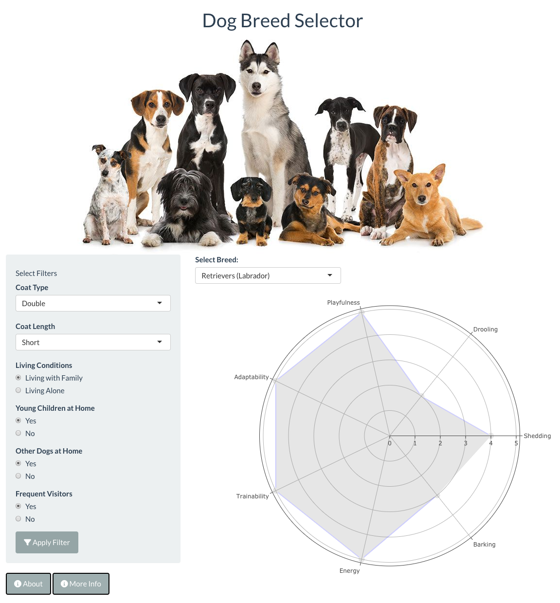

# Dog Breed Selector

## Overview
A simple [Shiny](https://shiny.rstudio.com/) interface to help users decide on a dog breed based on their chosen preferences. These preferences (filters) include the coat type, coat length, whether they are living alone or with family etc.

## Data Source
[TidyTuesday](https://github.com/rfordatascience/tidytuesday/blob/master/data/2022/2022-02-01/readme.md)
